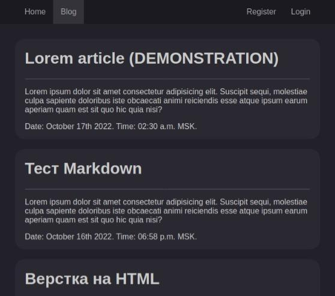
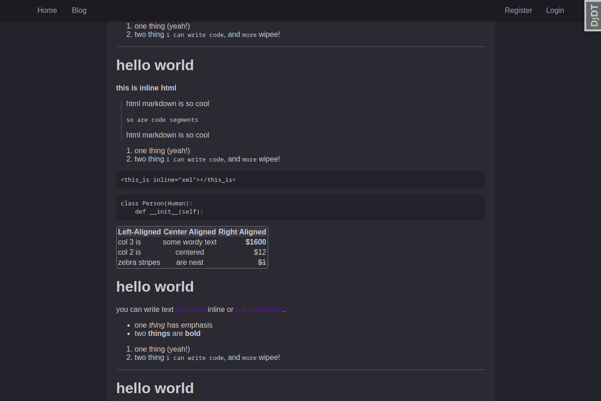

# YottaByteBlog

Mini blog made with Django.

This project was made to learn Django.

It implements some basic Django functionality.

## Implemented

- DB containing Posts and ColPosts
- homepage with dynamic content (ColPosts)
- blog
  - blogpage with dynamic content (Posts)
  - pages displaying posts
  - page for creating new posts
  - panels for managing posts (for authorized users)
  - pagination
  - translation from Markdown format to html
- simple registration
- simple login and logout

## Demonstration

